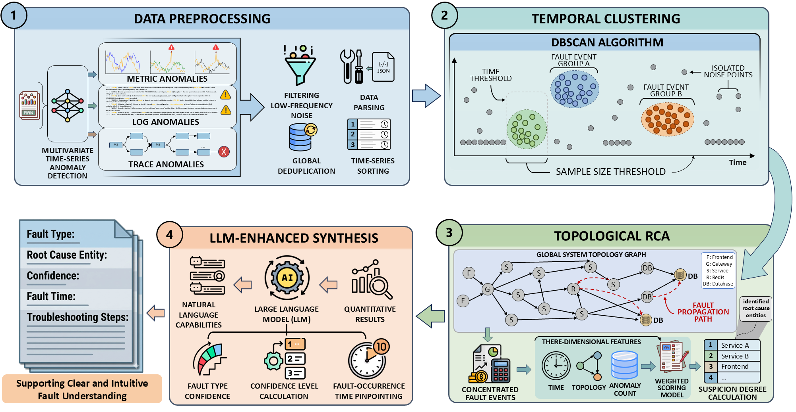

# ClusTopoRCA

&ensp;
[](https://opensource.org/licenses/MIT)&ensp;


</div>

ClusTopoRCA is a Clustering-Enhanced Topological Approach to LLM-Augmented microservice failure Root Cause Analysis. ClusTopoRCA follows a four-stage workflow for RCA in microservice systems. It first preprocesses multimodal anomaly data to ensure temporal and structural consistency across metrics, logs, and traces. It then applies temporal clustering to separate valid fault events from spurious noise. Next, a topology-aware scoring model ranks candidate entities according to their root-cause likelihood. Finally, an LLM-based synthesis stage converts the quantitative RCA results into structured and actionable diagnostic reports.

 

## 1.Quick Start

> ⚠️ We use the **OpenRCA** dataset and supplementary baseline **RCA-agent** (https://github.com/microsoft/OpenRCA) to evaluate ClusTopoRCA. Note: since the OpenRCA dataset includes a large amount of telemetry and RCA-agent requires extensive memory operations, we recommend using a device with at least 80GB of storage space and 32GB of memory.

## 2.Installation

ClusTopoRCA requires **Python >= 3.10**. It can be installed by running the following command:
```bash
# [optional to create conda environment]
# conda create -n openrca python=3.10
# conda activate openrca

# clone the repository
git clone https://github.com/grampus-whcz/ClusTopoRCA.git
cd ClusTopoRCA
# install the requirements
pip install -r requirements.txt
```

The telemetry data can be download from [Google Drive](https://drive.google.com/drive/folders/1wGiEnu4OkWrjPxfx5ZTROnU37-5UDoPM?usp=drive_link). Once you have download the telemetry dataset, please put them into the path `dataset/` (which is empty now).

The directory structure of the data is:

```
.
├── {SYSTEM}
│   ├── query.csv
│   ├── record.csv
│   └── telemetry
│       ├── {DATE}
│       │   ├── log
│       │   ├── metric
│       │   └── trace
│       └── ... 
└── ...
```

where the `{SYSTEM}` can be `Telecom`, `Bank`, or `Market`, and the `{DATE}` format is `{YYYY_MM_DD}`.

We employ **OmniTransfer** for Multivariate Time Series Anomaly Detection to derive anomaly information for multiple entities and features within the target time domain.
We made certain changes to enable it to handle OpenRCA data.

```bash

git clone https://github.com/grampus-whcz/OmniTransfer.git
cd OmniTransfer
# following the readme.md to install
pip install -r requirements.txt
```
Note: path used in ClusTopoRCA with OmniTransfer needs to be reconfigured. 

## 3.Reproduction

To reproduce results in the paper, please first setup your API configurations before running OpenRCA's baselines. Taking OpenAI as an example, you can configure `rca/api_config.yaml` file as follows:

```yaml
SOURCE:   "AI"
MODEL:    "gpt-4o"
API_KEY:  "sk-xxxxxxxxxxxxxx"
```

Then, run the following commands for result reproduction:

```bash
python -m rca.run_agent_standard_multi_candidate --dataset Bank --controller_max_step 1  --start_idx 0  --end_idx 135

python -m rca.run_agent_standard_multi_candidate --dataset Telecom --controller_max_step 1  --start_idx 0  --end_idx 50

python -m rca.run_agent_standard_multi_candidate --dataset Market/cloudbed-1 --controller_max_step 1  --start_idx 0  --end_idx 69

python -m rca.run_agent_standard_multi_candidate --dataset Market/cloudbed-2 --controller_max_step 1  --start_idx 0  --end_idx 77
```

The generated results and monitor files can be found in a new `test` directory created after running any test script.

You can also generate log file like those in experiments folder, and use two scripts (5.extract_all_key_info.py and 8.get_all_result_from_tasks_info_all_task_type.py) to get the statistical results.

## 4.some tips

### Method 1: Quickly load pkl
```bash
python -c "import pickle; data=pickle.load(open('index.pkl','rb')); print(f'Number of records: {len(data)}')"
```

### Method 2: Quickly load faiss index
```bash
python -c "import faiss; idx=faiss.read_index('index.faiss'); print(f'Number of records: {idx.ntotal}')"
```

## 5.copy framework
1. cp -r /root/shared-nvme/work/agent/OpenRCA XXX
2. replace "OmniTransfer_new" with a "OmniTransfer_new?", exclude files like "*.md, *.log, *.txt, *.json, *.ipynb"